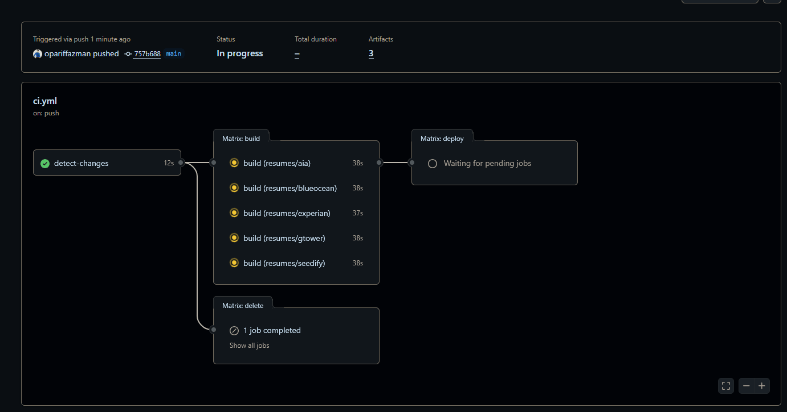
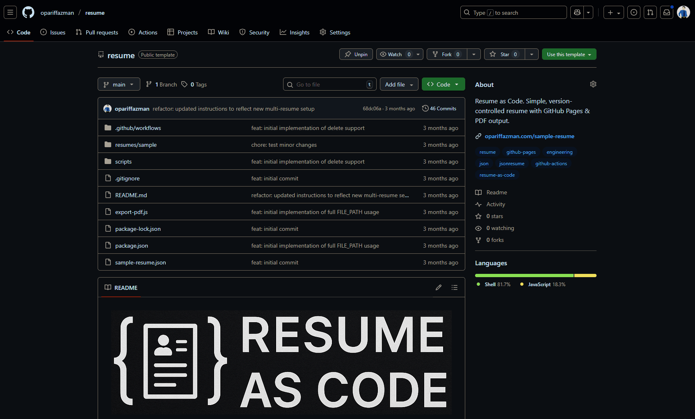

Manage multiple resume, with each getting its own `resume.json` file.

Automatically generate a professional resume with a proper PDF version, hosted for free via GitHub Pages.

Powered by: [JSONResume](https://jsonresume.org/) + Engineering [Theme](https://github.com/skoenig/jsonresume-theme-engineering) + [GH Pages](https://pages.github.com/)

Guided by: [r/EngineeringResumes](https://www.reddit.com/r/EngineeringResumes/wiki/index/)

# Behold...



## Features

- **Multi-Resume Support** - Manage multiple resumes for different job roles in one place.
- **One Source of Truth** - Just edit the `resume.json` for the resume you want to change.
- **Automated Deployment** - Websites are generated and deployed on every resume push.
- **Live Websites** - Each resume is hosted with GitHub Pages for free in its own repository.
- **Download PDF** - A print optimized version is available as downloadable PDF.
- **Clean Theme** - Minimal, readable and optimized to ATS standards.

## How It Works

1.  You copy the `resumes/sample` directory to a new one (e.g., `resumes/swe-google/`).
2.  You modify the `resume.json` file in this folder with your actual details.
3.  You push your code to GitHub so GitHub Actions automatically builds the site and PDF.
4.  The output is deployed to a separate resume repository (e.g., `swe-google-resume`) with GitHub Pages enabled.
5.  If you delete a resume folder, the corresponding repository is also deleted.

This lets you keep your resumes commit history private, while only making the live resume websites public.

## Setting up

1.  Click `Use this template` (top of this repo) → Choose **Private**.

    

2.  Go to: **Settings** → **Developer Settings** → **Personal Access Tokens** → Generate **new token (classic)**
    -   Name it: `resume-token`
    -   Scope: `repo` & `delete_repo`
    -   Copy and save the token.

    

3.  Go to: **Settings** → **Secrets and variables** → **Actions**
    -   **Secrets**
        -   `ACTIONS_PAT` → your GitHub token from earlier.

4.  Create your first resume by cloning your repo earlier:
    ```bash
    git clone <your-repo-url>
    cd <your-repo-name>

    # Copy the sample and start editing
    cp resumes/samples resumes/swe-google/ -r
    ```

5.  After editing `resumes/swe-google/resume.json`, commit and push the changes:
    ```bash
    git add .
    git commit -m "feat: initial commit"
    git push origin main
    ```

All done! You'll be able to access your live site at `https://<github_username>.github.io/swe-google-resume`.

## Run Locally (Optional)

Want to preview your resume before pushing?

Get [NodeJS](https://docs.npmjs.com/downloading-and-installing-node-js-and-npm) first

1.  Install dependencies:
    ```bash
    npm install
    npx playwright install chromium
    ```

2.  To build a specific resume, run the `build-resume.sh` script with the `FILE_PATH` environment variable:
    ```bash
    FILE_PATH=resumes/data-scientist ./scripts/build-resume.sh
    ```

You’ll find the generated `index.html`, `resume.html`, and `resume.pdf` inside the `resumes/data-scientist/` folder.

## Why?

This template gives you full control.

Version your resumes with Git, write them in JSON, and generate polished outputs

- [x] Versioned resume edits
- [x] Free ATS ready resume hosting
- [x] Resume-as-code like a pro
